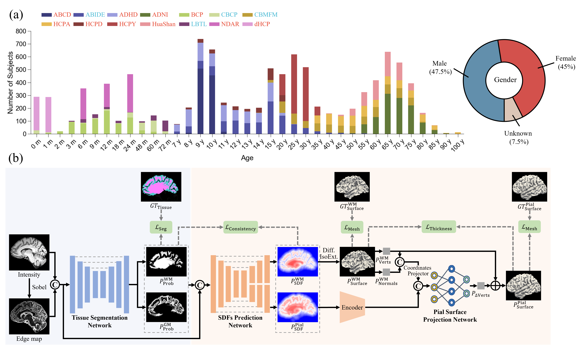

# UniSurf: Universal Lifespan Cortical Surface Reconstruction
We introduce UniSurf, a universal end-to-end deep learning framework designed for cortical surface reconstruction across the entire human lifespan (0-100 years). UniSurf jointly optimizes tissue segmentation and cortical surface reconstruction using a differentiable iso-surface extraction algorithm.

***
# Model overview
<div style="text-align: center">
  
</div>

# Results
<div style="text-align: center">
  
</div>

<div style="text-align: center">
  
</div>

***

# [<font color=#F8B48F size=3>License</font> ](./LICENSE)
```shell
Copyright IDEA Lab, School of Biomedical Engineering, ShanghaiTech University, Shanghai, China.

Licensed under the the GPL (General Public License);
you may not use this file except in compliance with the License.
You may obtain a copy of the License at

    http://www.apache.org/licenses/LICENSE-2.0

Repo for UniSurf: Universal Lifespan Cortical Surface Reconstruction
Contact: lianzf2024@shanghaitech.edu.cn
```
