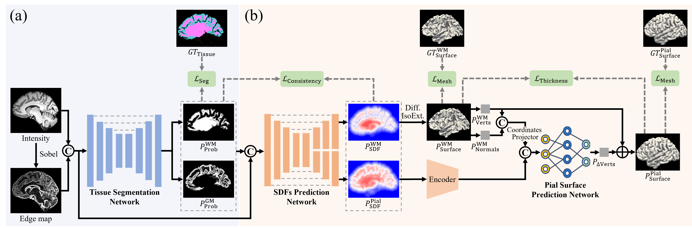

# UniSurf: Universal Lifespan Cortical Surface Reconstruction
We propose UniSurf, a universal deep learning framework that jointly performs brain tissue segmentation and cortical surface reconstruction from T1-weighted MRI across the lifespan. The framework integrates three models: (1) a tissue segmentation network that produces brain tissue probability maps from intensity images and their corresponding edge maps; (2) an SDFs prediction network that estimates SDFs of the white matter and pial surfaces; and (3) a pial surface prediction network that infers the pial surface based on the predicted white matter surface and pial SDF.

  

***
